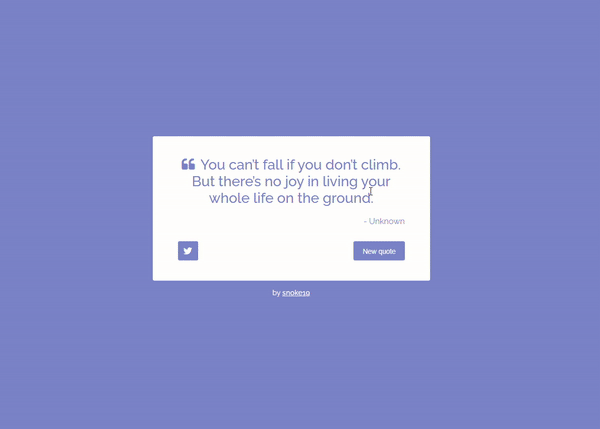

# Random Quote Machine

[](https://react.dev/)

A sleek, responsive Random Quote Machine built with **React 18**. This pet project serves as my learning playground for mastering React fundamentals, hooks, state management, and modern frontend practices.

---

## 📸 Preview

| Desktop Preview      | Mobile Preview |
|----------------------|----------------|
|  |  |

> _Note: Replace placeholder images with actual screenshots from `/public/` folder_

---

## ✨ Features

- ✅ **Random Quote Generation** - Fetch and display random quotes
- ✅ **Category Filtering** - Filter quotes by different categories
- ✅ **Responsive Design** - Works on mobile, tablet, and desktop
- ✅ **Modern UI** - Clean, intuitive user interface with smooth animations
- ✅ **Performance Monitoring** - Optional react-scan integration for debugging
- ✅ **Accessibility** - Built with a11y best practices in mind

---

## 🚀 Getting Started

### Prerequisites

- [Node.js](https://nodejs.org/) ≥ 18.0.0
- [npm](https://www.npmjs.com/) ≥ 9.0.0 (or [yarn](https://yarnpkg.com/))
- A modern web browser (Chrome, Firefox, Edge, Safari)

### Installation

1. **Clone the repository:**
   ```bash
   git clone https://github.com/your-username/random-quote-machine.git
   cd random-quote-machine
   ```

2. **Install dependencies:**
   ```bash
   npm install
   # or
   yarn install
   ```

3. **Run the development server:**
   ```bash
   npm start
   # or
   yarn start
   ```

   This will open [http://localhost:3000](http://localhost:3000) in your default browser.

### Available Scripts

| Script | Description |
|--------|-------------|
| `npm start` | Runs the app in development mode |
| `npm run build` | Builds the app for production |
| `npm test` | Launches the test runner |
| `npm run eject` | Ejects from Create React App (one-way operation) |
| `npm run start:scan` | Starts with react-scan performance monitoring enabled |
| `npm run start:no-scan` | Starts with react-scan disabled |

---

## 📂 Project Structure

```
random-quote-machine/
├── public/                    # Static files
│   ├── index.html             # HTML template
│   ├── favicon.ico            # Favicon
│   └── manifest.json         # PWA manifest
├── src/                       # Source code
│   ├── components/            # React components
│   │   ├── App.js             # Main App component
│   │   ├── CategoryList.js    # Category selection component
│   │   ├── QuoteCard.js       # Quote display component
│   │   └── ...
│   ├── services/              # API and business logic
│   │   ├── QuoteService.js    # Quote-related API calls
│   │   └── CategoryService.js # Category management
│   ├── utils/                 # Utility functions
│   │   └── errorUtils.js      # Error handling utilities
│   ├── index.js               # Application entry point
│   ├── index.css              # Global styles
│   └── App.css                # App-specific styles
├── package.json               # Project configuration
├── README.md                  # Project documentation
└── .gitignore                 # Git ignore rules
```

## 🔧 Configuration

### Environment Variables

Create a `.env` file in the project root for configuration:

```env
# Enable performance monitoring (default: false)
REACT_APP_SCAN_ENABLED=true

# API base URL (if using a custom quote API)
REACT_APP_API_BASE_URL=https://api.example.com
```